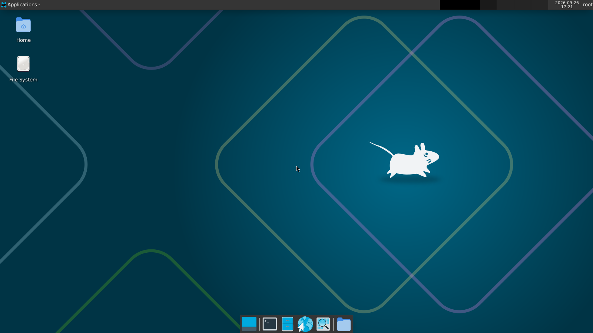

# pocket-linux

Карманная Linux-VM, которая запускается **без root, без установки пакетов и без KVM** — на Linux и macOS.
Качается из GitHub Releases одной командой, внутри — Alpine с Docker, SSH, интернетом
и (в варианте `desktop`) XFCE-рабочим столом через браузер.

Лаунчер берёт первый доступный движок, от быстрого к медленному (`POCKET_ENGINE=auto`);
`./pocket doctor` показывает, что из этого разрешено на машине, почему нет и что будет выбрано:

| движок | когда | скорость |
|---|---|---|
| **vz** | macOS: Apple Virtualization.framework (vfkit + gvproxy) | почти нативная; загрузка ~4 с; x86_64-программы через Rosetta |
| **kvm** | Linux с доступным вам `/dev/kvm`: QEMU + KVM | почти нативная |
| **uml** | Linux x86_64: User-Mode Linux | CPU нативно, системные вызовы в 2–7 раз медленнее; загрузка ~6 с |
| **tcg** | везде: QEMU-эмуляция | в 6–17 раз медленнее; загрузка ~2 мин |

- Все бинарники **статические**: QEMU (musl), ядро UML (glibc static), `pocket-net` (musl).
  На macOS статика невозможна — `vfkit` и `gvproxy` ссылаются только на системные фреймворки.
- UML — это ядро Linux, собранное как обычная программа: гость работает процессами
  пользователя, root/KVM/capabilities не нужны. Docker внутри работает полностью (bridge + NAT).
- Сеть — user-mode NAT (slirp), root не нужен. SSH и нужные порты пробрасываются на `127.0.0.1`.
- Общая папка с хостом: `~/.pocket/share` ↔ `/host` в госте.
- CA-сертификаты хоста автоматически прокидываются внутрь (корпоративные TLS-прокси).

## Быстрый старт

Одинаково на Linux и macOS (на Mac ничего ставить не нужно — `curl` и `ssh` есть в системе).

```sh
curl -fsSLO https://github.com/kalinkinisaac/pocket-linux/releases/latest/download/pocket && chmod +x pocket
./pocket doctor  # что разрешено на этой машине и что будет выбрано
./pocket up      # скачает ~150 МБ (desktop ~450), загрузит VM
./pocket ssh     # вы внутри, root
```

Свой форк или зеркало: `POCKET_REPO=owner/repo`; если он приватный — ещё `GH_TOKEN`
(fine-grained, `Contents: read`), лаунчер тогда качает файлы через API.

Рабочий стол:

```sh
POCKET_VARIANT=desktop ./pocket up
# браузер: http://localhost:6080/vnc.html   или VNC-клиент: localhost:5901
```




С удалённой машины пробросьте порт: `ssh -L 6080:localhost:6080 user@remote`.

## Команды

| команда | что делает |
|---|---|
| `pocket up` | скачать (если нужно) и запустить VM в фоне |
| `pocket ssh [cmd]` | зайти внутрь или выполнить команду |
| `pocket down` | выключить |
| `pocket run` | запустить на переднем плане с консолью (выход `Ctrl-A X`) |
| `pocket desktop` | поднять XFCE + noVNC (вариант desktop) |
| `pocket status` / `log` | состояние / последние строки консоли |
| `pocket reset` | вернуть диск к исходному образу |
| `pocket doctor` | движки от быстрого к медленному: доступен ли, почему нет, что исправить; сеть, прокси, порт |

## Настройки (переменные окружения)

| переменная | по умолчанию | |
|---|---|---|
| `POCKET_VARIANT` | уже запущенная VM, иначе `base` | `base` (Docker, SSH) или `desktop` (+ XFCE/noVNC) |
| `POCKET_MEM` | `auto` | МБ RAM; auto — 3/4 свободной памяти хоста, от 256 до 2048 |
| `POCKET_CPUS` | `auto` (≤4) | vCPU; в TCG каждый vCPU — отдельный поток хоста |
| `POCKET_DISK` | `20G` | максимальный размер диска (растёт по мере записи) |
| `POCKET_PORTS` | — | доп. пробросы: `"8080:80 3000"` → `127.0.0.1:8080→:80`, `3000→3000` |
| `POCKET_ENGINE` | `auto` | `vz` / `kvm` / `uml` / `tcg` принудительно (`qemu` = kvm, если можно, иначе tcg) |
| `POCKET_ROSETTA` | `1` | vz на Apple Silicon: x86_64-программы и `docker --platform linux/amd64` через Rosetta (если она стоит на Mac) |
| `POCKET_TMP` | авто | UML: каталог для файла RAM гостя (нужен exec и `POCKET_MEM` свободного места; по умолчанию `/dev/shm`, `$TMPDIR`, `~/.pocket`) |
| `POCKET_SSH_PORT` | `2222` | порт SSH на хосте |
| `POCKET_GUEST` | = арх. хоста | архитектура VM (чужая → только эмуляция) |
| `POCKET_HOME` | `~/.pocket` | где лежат образы и диски |
| `POCKET_SHARE` | `~/.pocket/share` | папка, видимая в госте как `/host` |
| `POCKET_TAG` | `latest` | версия релиза |
| `POCKET_URL` | GitHub Releases | свой адрес с файлами (зеркало, локальный HTTP) |
| `GH_TOKEN` | — | токен для приватного репо |

Хук: исполняемый `~/.pocket/share/.pocket/on-boot.sh` выполняется в госте при каждой загрузке.

## Сборка (воспроизводимая, в Docker)

Нужны только Docker с buildx. Root на целевых машинах не нужен никогда.

```sh
./make.sh --arch x86_64  --variant all      # → dist/x86_64/
./make.sh --arch aarch64 --variant base     # чужая арх. — через qemu-user binfmt (медленно)
./make.sh --arch x86_64 --guest aarch64     # QEMU для x86-хоста, эмулирующий ARM-гостя
./make.sh --dynamic                         # не статически: bin/ + lib/ + свой загрузчик
```

Результат `dist/<arch>/`:

```
pocket                          лаунчер (POSIX sh)
qemu-<host>-<guest>.tar.gz      статический qemu-system-<guest> + qemu-img + прошивки
vmlinuz-<guest>, initramfs-<guest>
pocket-base-<guest>.qcow2       образ диска (сжатый)
pocket-desktop-<guest>.qcow2
pocket-<variant>-<guest>.img.gz тот же диск в raw для движков UML и vz
linux-uml-x86_64                ядро UML, статический бинарник (~10 МБ) + .config
pocket-net-x86_64               сеть для UML: libslirp поверх fd-транспорта (~1.2 МБ)
SHA256SUMS-<arch>
```

Движок macOS — `mac/build.sh` (на Mac, нужны Xcode CLT и Go): vfkit и gvproxy из закреплённых
тегов исходников, vfkit подписывается ad-hoc с entitlement `com.apple.security.virtualization` →
`dist/darwin/vz-darwin-<arch>.tar.gz`. Образы гостя для Mac — те же aarch64/x86_64 из Linux-сборки.

UML собирается отдельным `uml/Dockerfile` (ядро 7.2.8 с проверкой sha256, конфиг
`uml/kernel.config`, патчи `uml/patches/`), `make.sh` делает это сам для x86_64 (`--no-uml` — пропустить).

Всё тяжёлое (пакеты, рабочий стол) ставится при сборке нативно, а не внутри медленной VM.
Если сборка идёт за корпоративным TLS-прокси, `make.sh` сам передаёт CA хоста
в сборку через build secret (отключается `--no-host-ca`).

### CI / релизы

`.github/workflows/build.yml` собирает x86_64 и aarch64 на нативных раннерах и движок macOS на `macos-14`.
Push тега `v*` → GitHub Release со всеми файлами. Ручной запуск — `workflow_dispatch`.
Для приватных репозиториев раннеры `ubuntu-24.04-arm` могут быть недоступны на вашем плане —
тогда уберите строку aarch64 или соберите его локально.

## Производительность

Замеры на 1 vCPU без KVM (подробнее — `docs/RESEARCH.md`). Время в мс, меньше — лучше.

| тест | хост | UML | QEMU TCG |
|---|---|---|---|
| gzip 20 МБ | 653 | 742 | 4686 |
| 300 fork+exec | 251 | 1104 | 4548 |
| запись 200 МБ (fsync) | 424 | 1041 | 2819 |
| 2000 мелких файлов | 71 | 483 | 2232 |
| `docker run --rm alpine true` | — | 841 | ~8000 |
| загрузка до SSH | — | **~6 с** | ~110 с |
| скачивание внутри | 59 МБ/с | на уровне хоста | 2.8 МБ/с |

macOS (vz), Apple M2 Pro, 4 vCPU, против самого macOS (APFS):

| тест | macOS | pocket (vz) |
|---|---|---|
| gzip 20 МБ | 747 | 953 |
| 300 fork+exec | 185 | 58 |
| запись 200 МБ (fsync) | 352 | 227 |
| 2000 мелких файлов | 200 | 49 |
| `docker run --rm alpine true` | — | ~110 (amd64 через Rosetta — столько же) |
| загрузка до SSH | — | **~4 с** |
| скачивание внутри | 3.3 МБ/с | 2.7 МБ/с (упирается в канал) |

UML: вычисления почти нативно, дороже всего частые системные вызовы (процессы, мелкие файлы).
QEMU TCG: медленно всё. С KVM всё близко к нативу.

## Безопасность

SSH слушает только `127.0.0.1`, но на общей машине туда могут подключиться другие
пользователи, поэтому вход только по ключу (`~/.pocket/id_ed25519`), пароль root отключён.
Проброшенные через `POCKET_PORTS` сервисы (и noVNC в desktop-варианте, он без пароля)
доступны всем локальным пользователям хоста.

vz — настоящая VM на гипервизоре macOS; сеть и пробросы — gvproxy в пространстве пользователя,
порты слушают только `127.0.0.1`.

UML изолирует слабее настоящей VM (режим seccomp не закрывает гостю доступ ко всей его «физической»
памяти, гость работает с правами вашего пользователя). Это удобная песочница, не граница безопасности.
`hostfs` в UML ограничен папкой `POCKET_SHARE`.

## Ограничения

- Хост — Linux (x86_64 / aarch64 / riscv64) или macOS (проверено на macOS 26, Apple Silicon;
  Intel Mac собирается, но не проверялся).
- macOS: `pocket run` требует настоящий терминал (vfkit переводит его в raw-режим).
- UML — только x86_64-хост и x86_64-гость (в основной ветке ядра UML есть только для x86).
- UML внутри Docker-контейнера хоста: маленький `/dev/shm` (64 МБ) → лаунчер возьмёт другой каталог;
  профиль seccomp Docker по умолчанию может мешать — не проверено.
- Состояние дисков у движков раздельное: `disk.qcow2` (QEMU) и `disk.img` (UML, vz).
- Без KVM всё медленное; это цена «работает где угодно».
- Если в госте не работает DNS/сеть — проверьте, что хосту разрешены исходящие соединения;
  slirp использует обычные сокеты процесса.
